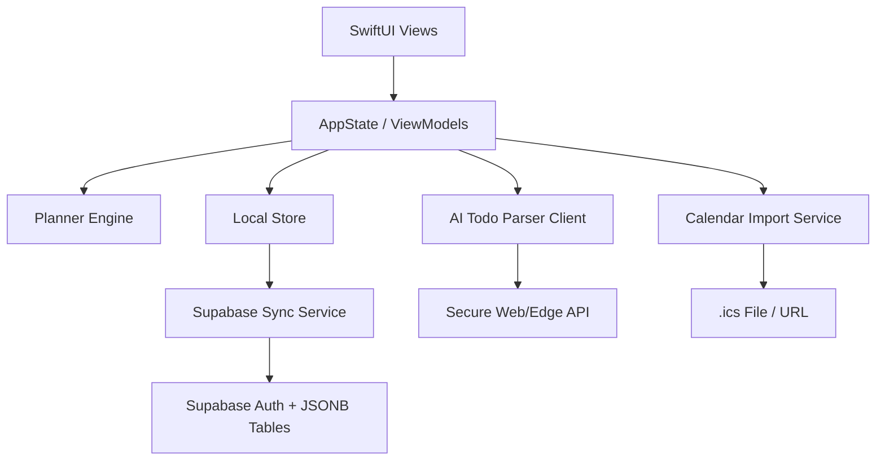

# iOS Architecture And Build Plan

## Recommended Stack

- Swift
- SwiftUI
- Supabase Swift SDK
- Local persistence: SQLite/SwiftData or JSON cache for MVP
- Async/await services
- XCTest for model/time/sync logic

## Project Modules

```text
LizhiRoutine-iOS/
  App/
    LizhiRoutineApp.swift
    AppState.swift
    SessionState.swift

  Models/
    Schema.swift
    Envelopes.swift
    IDs.swift

  Theme/
    Theme.swift
    TierStyle.swift
    Palette.swift

  Store/
    LocalStore.swift
    MigrationService.swift
    PendingMutationQueue.swift

  Services/
    SupabaseClientFactory.swift
    AuthService.swift
    SyncService.swift
    TodoParserService.swift
    CalendarImportService.swift

  Planner/
    TimeMath.swift
    VisibleTaskBuilder.swift
    PeriodEngine.swift
    StatisticsEngine.swift
    DeadlineEngine.swift

  UI/
    Today/
    Timeline/
    Todos/
    Routines/
    Periods/
    Stats/
    Settings/
    Editors/

  Tests/
    TimeMathTests.swift
    SchemaRoundTripTests.swift
    StatisticsTests.swift
    SyncMappingTests.swift
```

## Architecture Diagram



## Build Phases

### Phase 1: Contract And Skeleton

- Create SwiftUI project.
- Add Supabase SDK.
- Define Codable models matching `lib/schema.ts`.
- Add sample JSON round-trip tests.
- Build app theme tokens.

### Phase 2: Auth And Sync

- Sign in/out.
- Pull `user_state`.
- Pull `day_tasks` for selected date range.
- Write local cache.
- Push mutations back to Supabase.

### Phase 3: Planner Engine

- Port 5am-to-5am time math.
- Port visible range logic.
- Port period active/segment logic.
- Port stats aggregation by `source_id`.
- Add unit tests before UI complexity grows.

### Phase 4: Today Timeline

- Build timeline scroll view.
- Render fixed blocks.
- Render routines/todo blocks.
- Render current time.
- Render deadlines.
- Add tap-to-edit.

### Phase 5: Todos And Routines

- Build todo grouped list.
- Build todo editor.
- Build routine library.
- Build routine editor.
- Add schedule actions.
- Add drag after tap scheduling works.

### Phase 6: Stats And Settings

- Build stats page.
- Add `.ics` import.
- Add AI todo import through secure endpoint.
- Add settings controls.

### Phase 7: Interaction Polish

- Drag to schedule.
- Resize timeline blocks.
- Haptics.
- Undo delete.
- Accessibility pass.

## Key Engineering Decisions

### Local Storage

Use a local cache even with Supabase. The app should open quickly and work through spotty network.

### Conflict Policy

MVP can be last-write-wins, but code should isolate conflict policy in `SyncService`.

### Time Math

Use `Calendar` and `DateComponents`. Avoid string-only date math except for stable `YYYY-MM-DD` keys.

### Stats

Stats must aggregate placed timeline blocks:

- routine by `Task.source_id -> RoutineTemplate.id`,
- todo by `Task.source_id -> TodoItem.id`.

Never infer stats from todo due dates or routine defaults.

