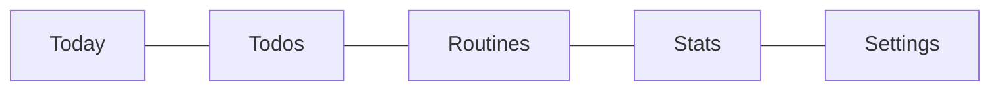
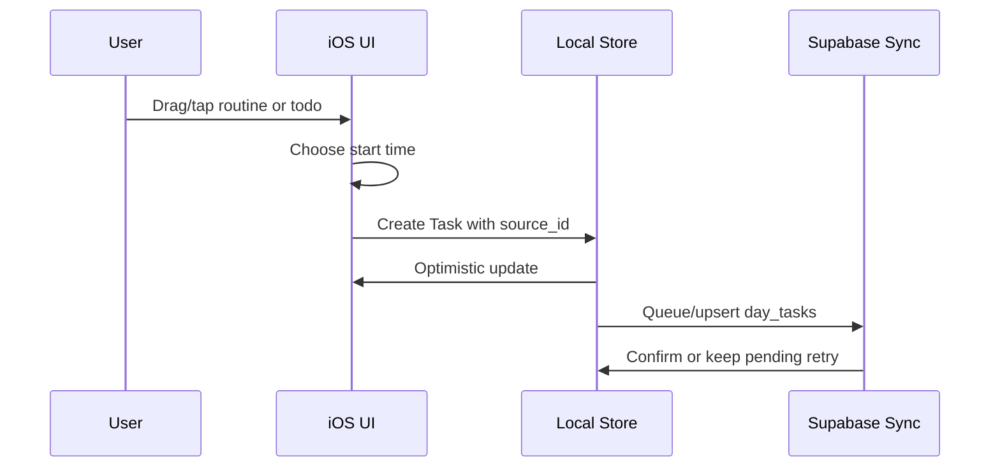
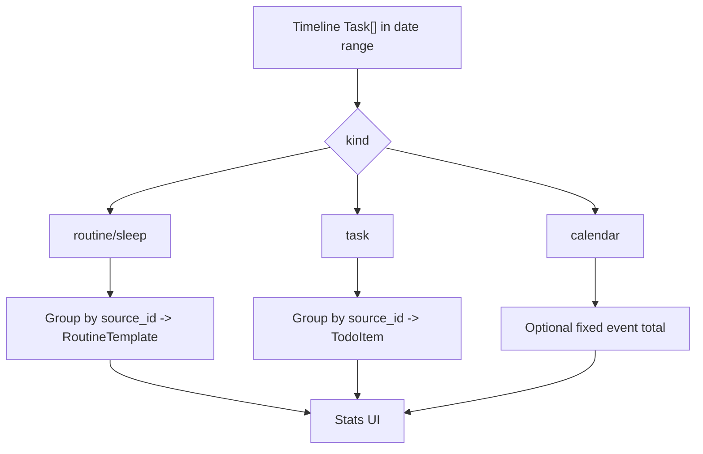

# Wireframes And Flows

These are text-first visual references that can be pasted into an implementation chat without image files.

## iPhone Tab Structure



## Today Screen

```text
+-------------------------------------+
| <  Saturday 9 May 2026  >     Today |
| Day   Week   Month   Stats          |
+-------------------------------------+
| Saturday 9 May                      |
| 07:00-17:00 / 4 scheduled / 2 due   |
+------+------------------------------+
| 5 AM |                              |
| 6 AM | +--------------------------+ |
|      | | T1 moon Sleep     05-07  | |
| 7 AM | +--------------------------+ |
| 8 AM | +--------------------------+ |
|      | | T2 bolt Commute  08-09   | |
| 9 AM | +--------------------------+ |
|      | | T1 cal Laboratory 09-12  | |
| 10AM | |                          | |
| 11AM | |        -- NOW 11:42 --   | |
| 12PM | +--------------------------+ |
| 1 PM |   flag due 14:20 / Genius Bar|
+------+------------------------------+
```

## Todo List Screen

```text
+-------------------------------------+
| Todos                         +     |
| AI Import collapsed                 |
+-------------------------------------+
| v BPS3071                       3   |
| +-------------------------------o-+ |
| | Lab 3 Micelles, Cyclodextrins...| |
| | T0  BPS3071  in 3 days at 23:55 | |
| +---------------------------------+ |
| +-------------------------------o-+ |
| | Workshop 5 Submission           | |
| | T0  BPS3071  17 May at 23:55    | |
| +---------------------------------+ |
|                                     |
| > Project                       1   |
+-------------------------------------+
```

## Routine Library Screen

```text
+-------------------------------------+
| Routines                      + New |
+-------------------------------------+
| +----+  Gym                         |
| | ic |  T0  2h                      |
| +----+                              |
| +----+  Commute                     |
| | ic |  T2  30m                     |
| +----+                              |
| +----+  Shower                      |
| | ic |  T0  30m                     |
| +----+                              |
+-------------------------------------+
```

## Editor Modal

```text
+-------------------------------------+
| EDIT TODO                         x |
| Lab 3 Micelles, Cyclodextrins and...|
| Tier T0 / BPS3071 / 2026-05-12 23:55|
+-------------------------------------+
| TITLE     Lab 3 Micelles...         |
| TIER      T0   T1   T2              |
| LIST      BPS3071              v    |
| DUE       2026/05/12 / 23:55        |
| TAGS      Lab report x Submission x |
+-------------------------------------+
| Delete                 Cancel  Save |
+-------------------------------------+
```

## Scheduling Flow



## Stats Flow


